# AWS Full-Stack Application

A production-ready Node.js full-stack application deployed entirely on AWS infrastructure. Features secure authentication, PostgreSQL (Amazon RDS), automated CI/CD with **Blue/Green deployment**, and a scalable architecture using an **Auto Scaling Group (ASG)**, Application Load Balancer, CloudFront, and S3.


---

## Table of Contents

- [Overview](#overview)
- [Architecture](#architecture)
- [Features](#features)
- [Project Structure](#project-structure)
- [Technology Stack](#technology-stack)
- [Prerequisites](#prerequisites)
- [Local Development](#local-development)
- [AWS Deployment](#aws-deployment)
- [API Reference](#api-reference)
- [Configuration](#configuration)
- [Troubleshooting](#troubleshooting)

---

## Overview

This application demonstrates a complete AWS-native deployment pipeline:

- **Runtime:** Node.js 20.x with Express
- **Database:** Amazon RDS (PostgreSQL)
- **Compute:** Auto Scaling Group (ASG) — EC2 instances managed by ASG, not standalone EC2
- **Deployment:** Blue/Green via CodeDeploy for zero-downtime releases
- **Static Assets:** S3 + CloudFront with Origin Access Control
- **CI/CD:** CodePipeline → CodeBuild → CodeDeploy
- **Secrets:** AWS Secrets Manager for database credentials and JWT

---

## Architecture

### Final Architecture Diagram

The diagram below illustrates the complete AWS infrastructure: user traffic flow, VPC layout (public/private subnets), application tier, RDS database, and the CI/CD pipeline from CodeCommit through CodeDeploy.

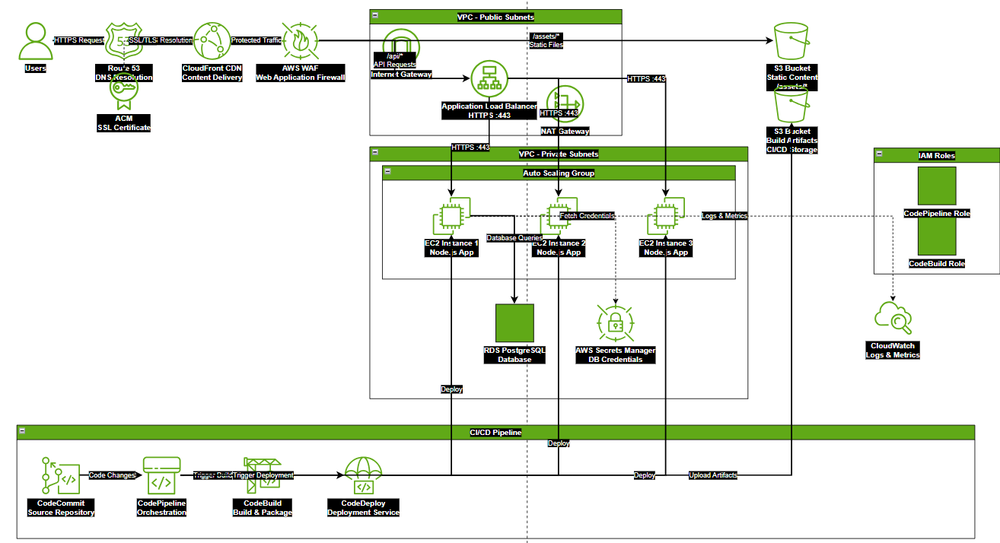

**Traffic flow summary:**
1. **Frontend/Static:** User → CloudFront → S3 (Static Content)
2. **API/Dynamic:** User → Route 53 → CloudFront → WAF → ALB → ASG (EC2 instances) → RDS (PostgreSQL)
3. **Deployment:** CodeCommit → CodePipeline → CodeBuild → CodeDeploy (Blue/Green) → ASG

### VPC and Network Infrastructure

The application runs within a VPC with public and private subnets. The ALB resides in public subnets; EC2 instances in the ASG and the RDS database run in private subnets for enhanced security.

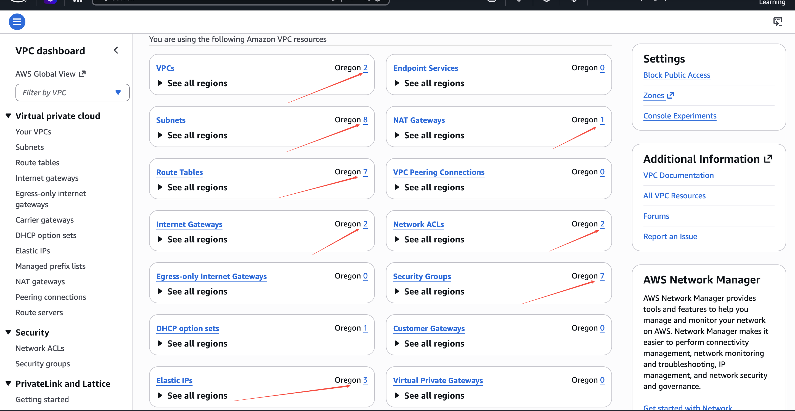

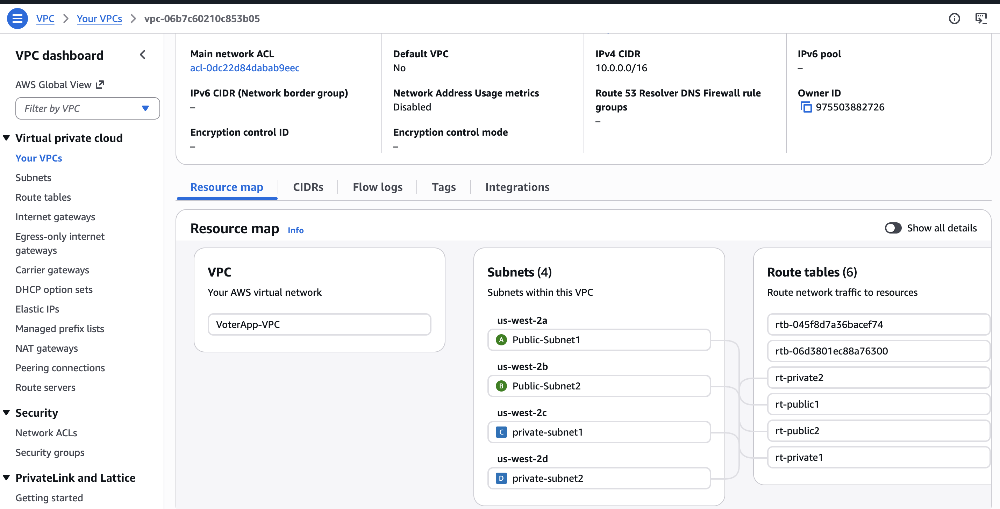

### CloudFront Configuration

CloudFront serves as the entry point, routing requests by path. Configure **two separate origins** within the distribution:

**S3 Origin (Frontend):**
- **Origin Domain:** Your static content bucket (e.g. `your-app-bucket.s3.amazonaws.com`)
- **Origin Access:** Use **Origin Access Control (OAC)** so the bucket remains private

**ALB Origin (Backend):**
- **Origin Domain:** DNS name of the Application Load Balancer
- **Protocol:** HTTPS Only

| Path Pattern | Origin | Purpose |
|--------------|--------|---------|
| `/api/*` | ALB | Backend API (auth, counter, health) |
| `*` (default) | S3 | Static frontend (HTML, CSS, JS) |

**Backend API behavior** (create first / place at top): Path `/api/*`, allow methods `GET`, `HEAD`, `OPTIONS`, `PUT`, `POST`, `PATCH`, `DELETE` (required for signup/login). Use `Managed-CachingDisabled` and `Managed-AllViewer` origin request policy.

**Frontend default behavior:** Path `*`, allow `GET`, `HEAD`, use `Managed-CachingOptimized`.

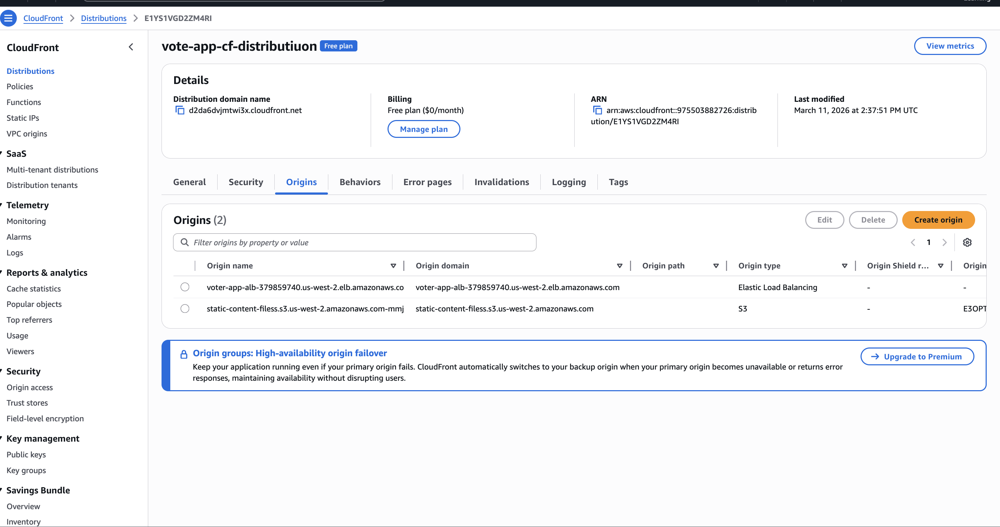

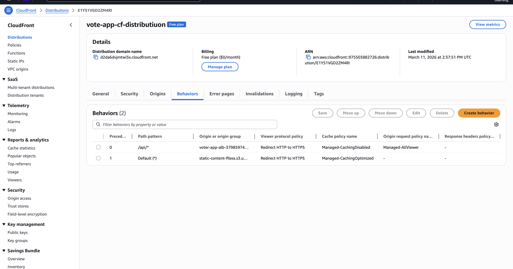

### Application Load Balancer and Target Group

The ALB distributes HTTPS traffic to EC2 instances in the ASG via the target group. Health checks use `/api/health`.

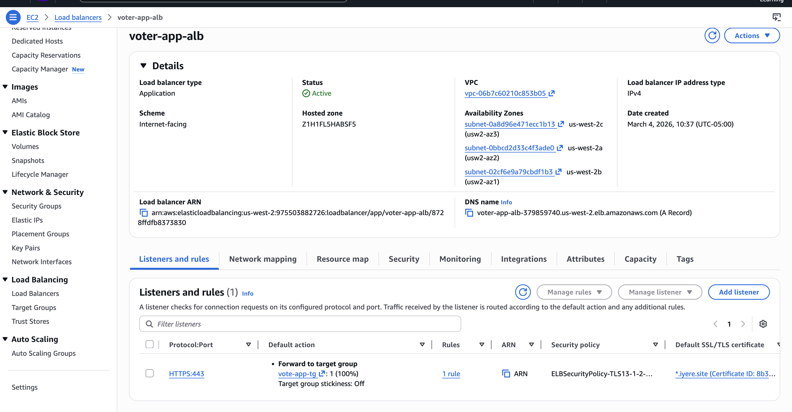

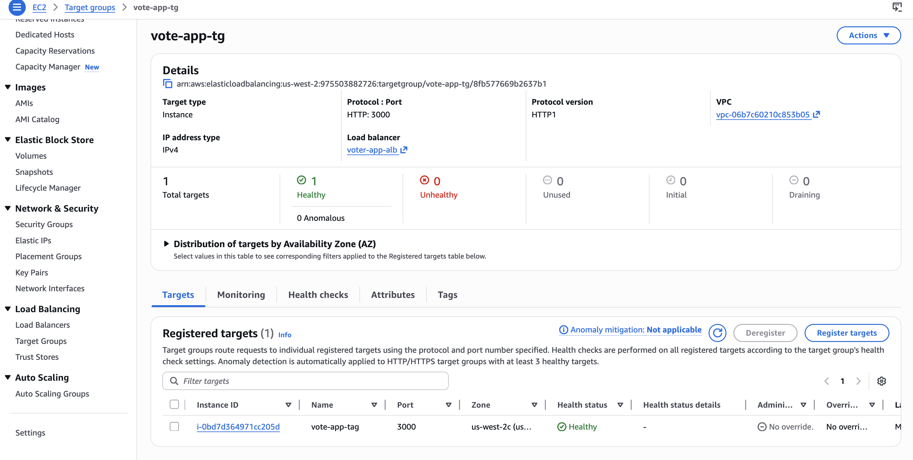

### Auto Scaling Group (ASG)

**Compute is managed by an ASG, not standalone EC2.** The ASG launches and maintains EC2 instances. CodeDeploy uses a **Blue/Green deployment** approach: it scales the ASG to add new (green) instances, deploys the new revision, validates health, then switches ALB traffic from old (blue) to green. Old instances are terminated after cutover.

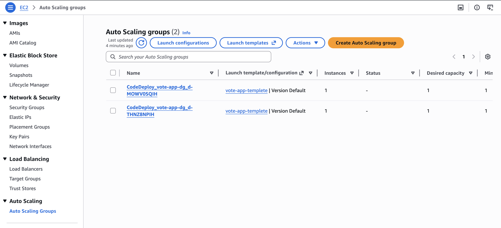

---

## Features

### Application UI

The frontend provides a clean, responsive interface for authentication and an interactive counter.

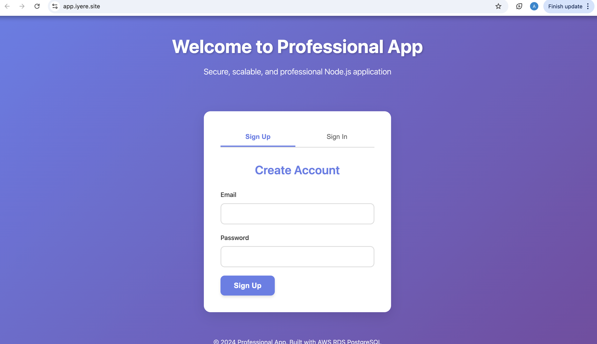

### Successful Authentication

After signing in, users can access the protected counter feature.

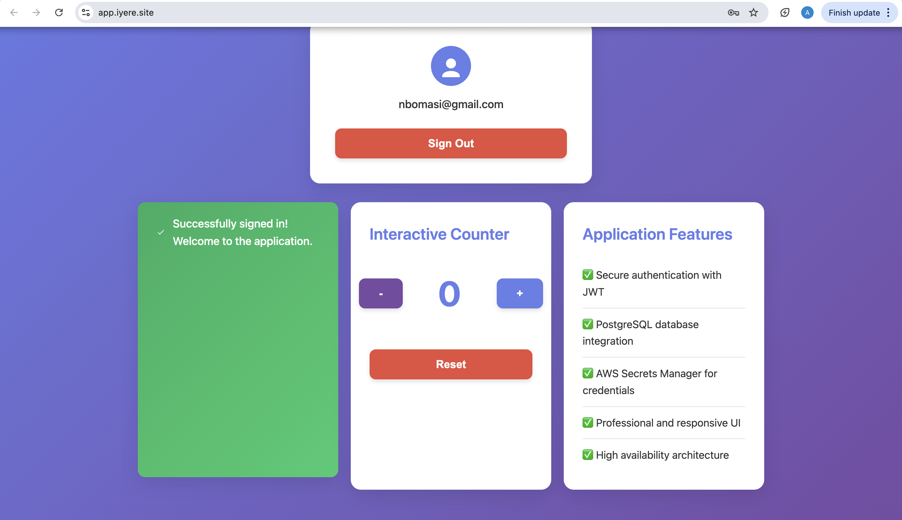

### Key Capabilities

- **Authentication:** JWT-based sign-up and sign-in with bcrypt password hashing
- **User-Specific Counter:** Per-user counter stored in PostgreSQL
- **Health Check:** `/api/health` endpoint with database connectivity check
- **Database Migrations:** Automated migrations via CodeDeploy `AfterInstall` hook
- **Secrets Management:** Credentials stored in AWS Secrets Manager (no `.env` in production)
- **Blue/Green Deployment:** Zero-downtime deployments via CodeDeploy

---

## Project Structure

```
aws-fullstack-app/
├── backend/
│   ├── config/
│   │   └── database.js          # RDS connection via Secrets Manager
│   ├── migrations/
│   │   ├── 001_create_users_table.sql
│   │   └── 002_create_counter_table.sql
│   ├── routes/
│   │   ├── auth.js               # /api/auth/signup, /api/auth/signin
│   │   └── api.js                # /api/counter (protected)
│   ├── scripts/
│   │   ├── check-and-run-migrations.js
│   │   └── run-migrations.js
│   ├── server.js
│   └── package.json
├── frontend/
│   ├── index.html
│   ├── app.js
│   └── styles.css
├── images/                       # Architecture diagrams and screenshots
├── scripts/
│   ├── create_app_dir.sh
│   ├── application_stop.sh
│   ├── application_start.sh
│   ├── install.sh                # CodeDeploy AfterInstall
│   └── validate_service.sh      # CodeDeploy ValidateService
├── buildspec.yml                 # CodeBuild specification
├── appspec.yml                   # CodeDeploy specification
└── README.md
```

---

## Technology Stack

| Layer | Technology |
|-------|------------|
| **Runtime** | Node.js 20.x |
| **Framework** | Express.js |
| **Database** | PostgreSQL (Amazon RDS) |
| **Auth** | JWT, bcrypt |
| **Secrets** | AWS Secrets Manager |
| **Compute** | Auto Scaling Group (EC2 instances) |
| **Load Balancer** | Application Load Balancer |
| **CDN** | CloudFront |
| **Static Hosting** | S3 |
| **CI/CD** | CodePipeline, CodeBuild, CodeDeploy |

---

## Prerequisites

- **Node.js** 20.x
- **npm** 10.x or later
- **AWS CLI** configured (`aws configure`)
- **PostgreSQL** (for local development) or RDS endpoint

---

## Local Development

### 1. Clone and Install

```bash
git clone <repository-url>
cd aws-fullstack-app
cd backend && npm install
```

### 2. Configure Environment

Create `backend/.env`:

```env
DB_HOST=localhost
DB_PORT=5432
DB_NAME=your_db_name
DB_USER=your_db_user
DB_PASSWORD=your_db_password
JWT_SECRET=your-jwt-secret
PORT=3000
```

For AWS (Secrets Manager), set:

```env
DB_SECRET_NAME=sam-secrets
AWS_REGION=eu-west-1
```

### 3. Run Migrations

```bash
cd backend
npm run migrate:check
# or
npm run migrate
```

### 4. Start Server

```bash
npm start
```

Open http://localhost:3000

---

## AWS Deployment

### Infrastructure Summary

| Component | AWS Service |
|-----------|-------------|
| Source Control | CodeCommit |
| Build | CodeBuild |
| Deploy | CodeDeploy (Blue/Green) |
| Compute | Auto Scaling Group (ASG) — not standalone EC2 |
| Database | Amazon RDS (PostgreSQL) |
| Load Balancing | Application Load Balancer |
| Static Content | S3 + CloudFront |
| Secrets | Secrets Manager |
| DNS/HTTPS | Route 53 + ACM |

### S3 Buckets

**Static content bucket** — Frontend files served via CloudFront:

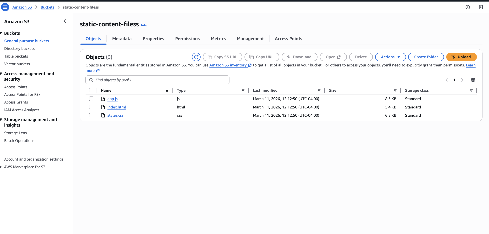

**Build artifacts bucket** — CodeBuild outputs and CodeDeploy packages:

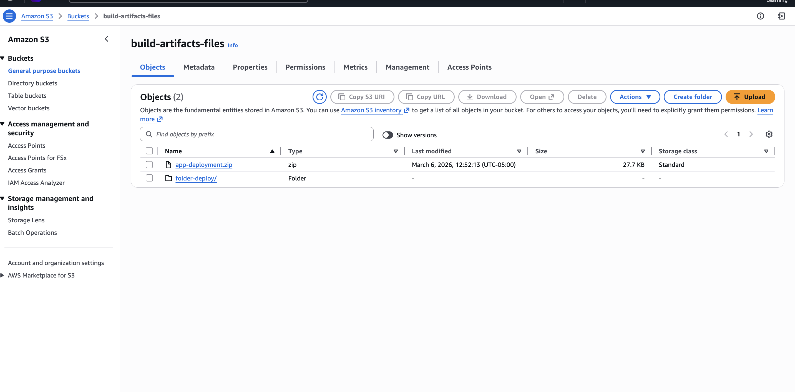

### Secrets Manager

Database credentials and JWT secret are stored in AWS Secrets Manager. The IAM instance profile attached to ASG instances must have `secretsmanager:GetSecretValue` permission.

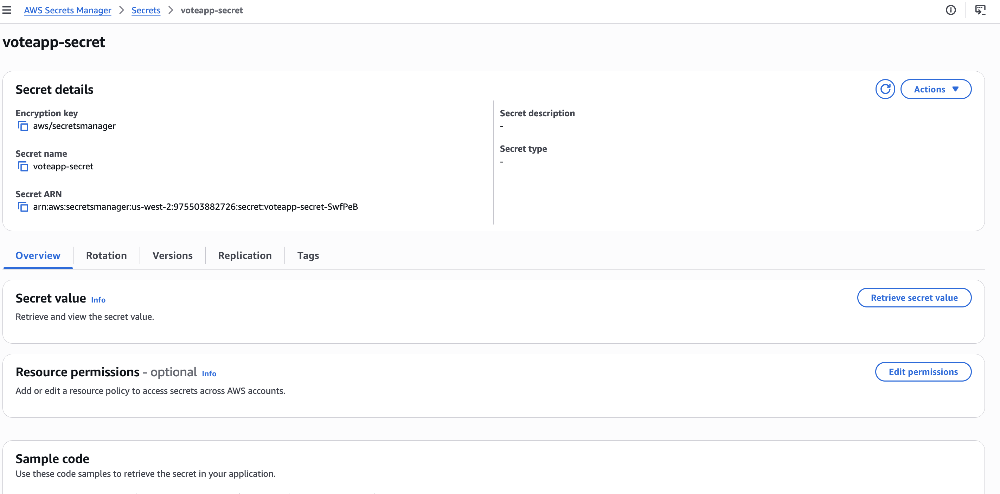

Store a secret (e.g. `sam-secrets`) with keys:

| Key | Description |
|-----|-------------|
| `host` | RDS endpoint hostname |
| `port` | 5432 |
| `dbname` | Database name |
| `username` | Database user |
| `password` | Database password |
| `jwt_secret` | JWT signing key |

### Database (RDS) Configuration

The application connects to Amazon RDS (PostgreSQL). Ensure the RDS security group allows inbound traffic from the ASG instances' security group on port 5432.

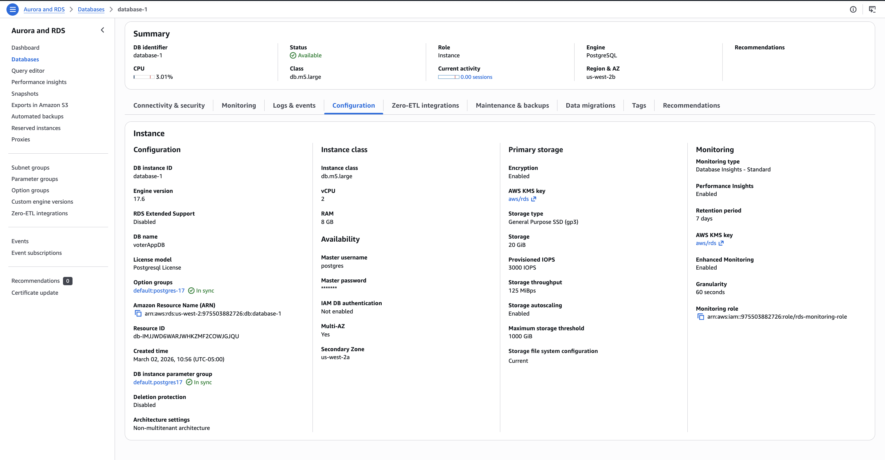

### Security Groups

Security groups control traffic between ALB, ASG instances, and RDS:

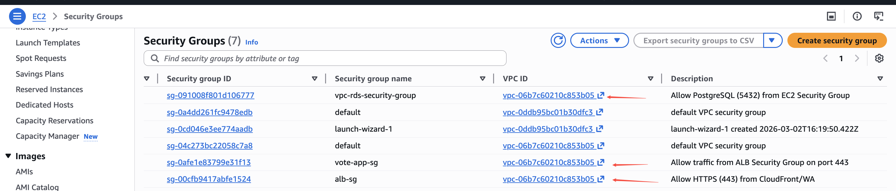

### IAM Roles

IAM roles for CodePipeline, CodeBuild, CodeDeploy, and the ASG instance profile must be configured with appropriate permissions:

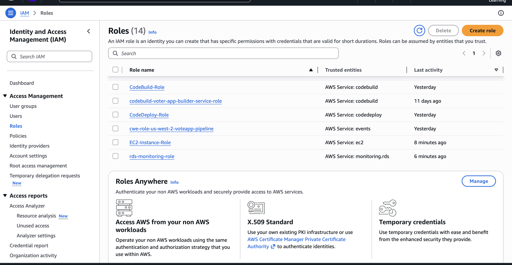

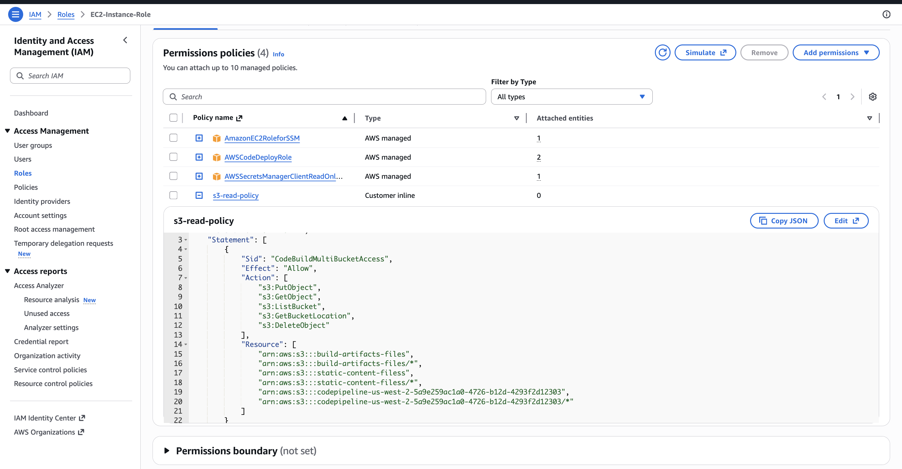

### Certificate Manager and Route 53

ACM provides SSL/TLS certificates for HTTPS. Route 53 manages DNS and points to the CloudFront distribution.

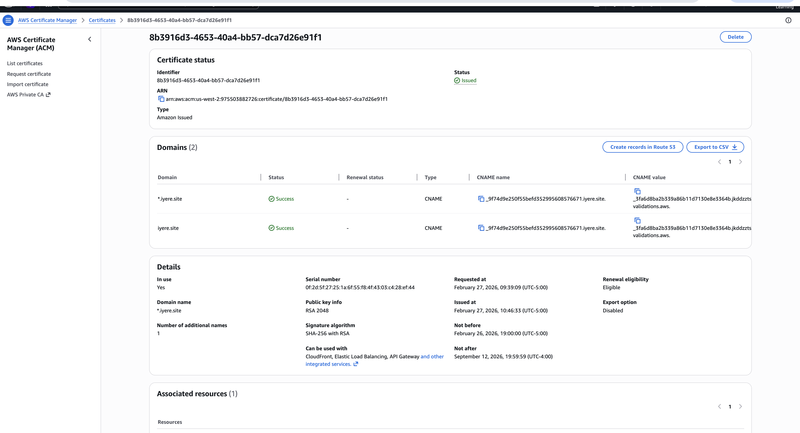

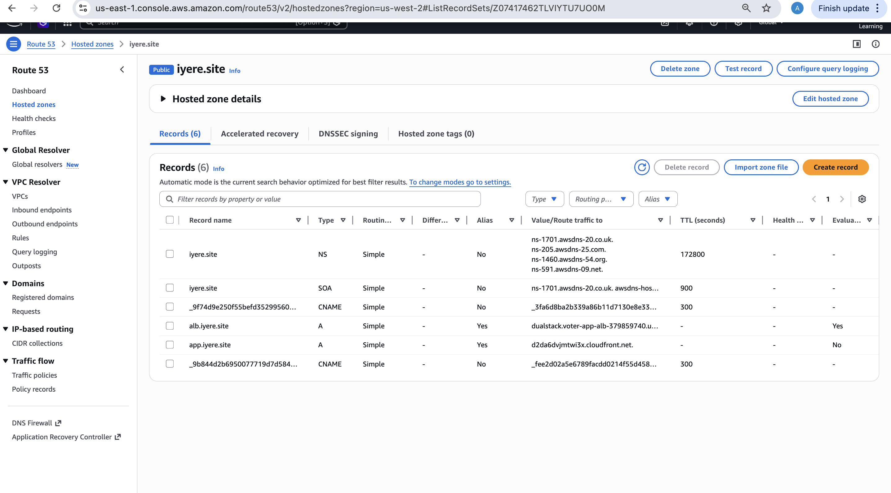

### CI/CD Pipeline

The pipeline runs automatically on code changes: Source (CodeCommit) → Build (CodeBuild) → Deploy (CodeDeploy).

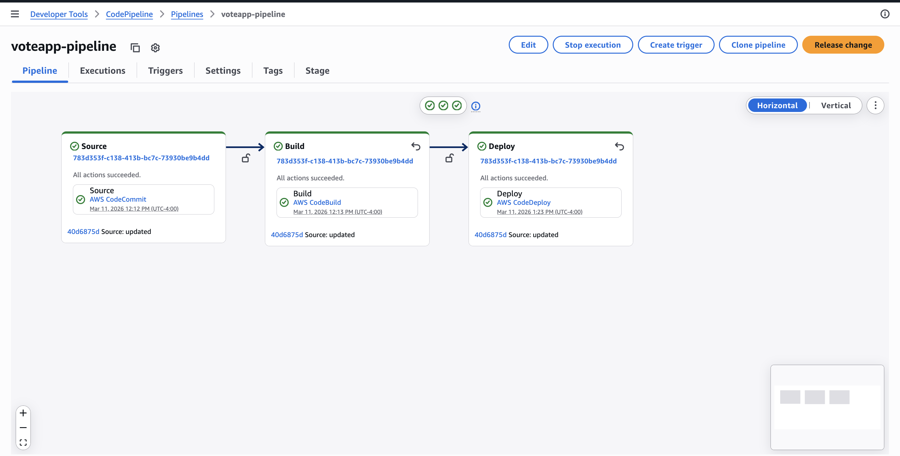

### Blue/Green Deployment

This project uses **Blue/Green deployment** (not in-place). CodeDeploy launches new instances in the ASG, deploys the new revision, validates via `/api/health`, then switches ALB traffic from blue to green. Old instances are terminated after cutover. Requires ASG **Max ≥ 2** so capacity is available for green instances during deployment.

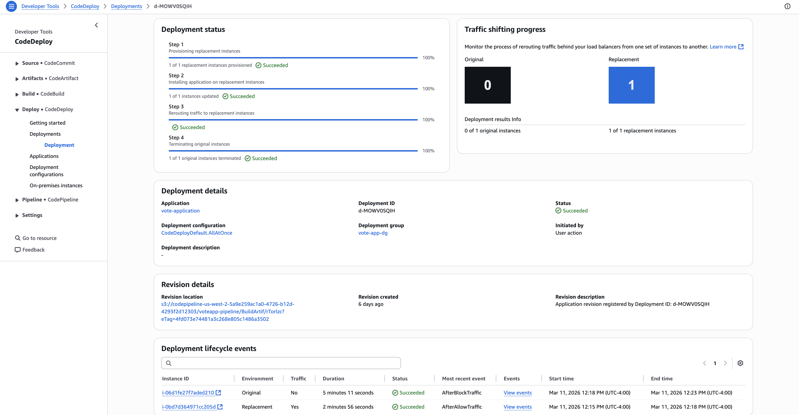

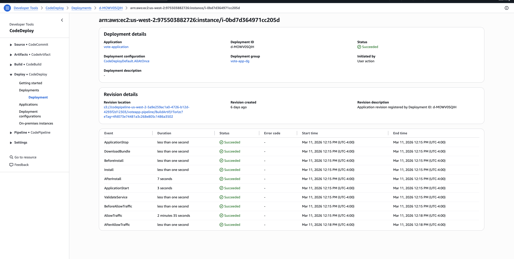

### CodeDeploy Hooks

| Hook | Script | Purpose |
|------|--------|---------|
| BeforeInstall | `create_app_dir.sh` | Create `/var/www/app` |
| BeforeInstall | `application_stop.sh` | Stop running app |
| AfterInstall | `install.sh` | npm install, run migrations |
| ApplicationStart | `application_start.sh` | Start Node.js server |
| ValidateService | `validate_service.sh` | Verify `/api/health` returns 200 |

### Health Check

The ALB target group health check should use:

- **Path:** `/api/health`
- **Expected:** 200 OK with `{"status":"ok","database":"connected"}`

---

## API Reference

### Public Endpoints

| Method | Endpoint | Description |
|--------|----------|-------------|
| GET | `/api/health` | Health check + DB connectivity |
| POST | `/api/auth/signup` | Create account |
| POST | `/api/auth/signin` | Sign in |

### Protected Endpoints (Bearer token required)

| Method | Endpoint | Description |
|--------|----------|-------------|
| GET | `/api/counter` | Get user's counter value |
| PUT | `/api/counter` | Update counter (`{"value": number}`) |

### Example: Sign Up

```bash
curl -X POST https://your-api-domain/api/auth/signup \
  -H "Content-Type: application/json" \
  -d '{"email":"user@example.com","password":"securepass123"}'
```

---

## Configuration

### Buildspec (CodeBuild)

- **Node.js:** Set `runtime-versions.nodejs: 20` in `buildspec.yml`
- **Static bucket:** Set `STATIC_CONTENT_BUCKET` in `buildspec.yml` `env.variables`
- **Artifacts:** Backend + scripts copied to `artifacts/`, frontend synced to S3

### Environment Variables (ASG instances)

| Variable | Default | Description |
|----------|---------|-------------|
| `PORT` | 3000 | Application port |
| `AWS_REGION` | us-west-2 | AWS region for Secrets Manager |
| `DB_SECRET_NAME` | voteapp-secret | Secrets Manager secret name |
| `NODE_ENV` | production | Set by `application_start.sh` |

---

## Troubleshooting

### Signup returns 403 Forbidden

- **Cause:** CloudFront behavior may not allow POST for `/api/*`
- **Fix:** Edit CloudFront behavior → Allowed HTTP Methods → Include `POST`, `OPTIONS`

### "Failed to create account" (500)

- **Cause:** Database connection or migrations
- **Fix:** Check RDS connectivity, run migrations manually: `node scripts/check-and-run-migrations.js`

### AccessDeniedException (Secrets Manager)

- **Cause:** ASG instance profile lacks `secretsmanager:GetSecretValue`
- **Fix:** Add policy to the IAM role attached to the ASG launch template for `arn:aws:secretsmanager:REGION:ACCOUNT:secret:sam-secrets*`

### Migration: "Cannot use a pool after calling end"

- **Cause:** `check-and-run-migrations.js` closed the pool before `runMigrations` used it
- **Fix:** Ensure the script does not call `pool.end()` in `checkIfMigrationNeeded()` (see `scripts/check-and-run-migrations.js`)

### Stop/Restart Application (on ASG instance)

SSH or use Session Manager to connect to an instance, then:

```bash
# Stop
/var/www/app/scripts/application_stop.sh

# Start
/var/www/app/scripts/application_start.sh
```

---

## License

ISC
